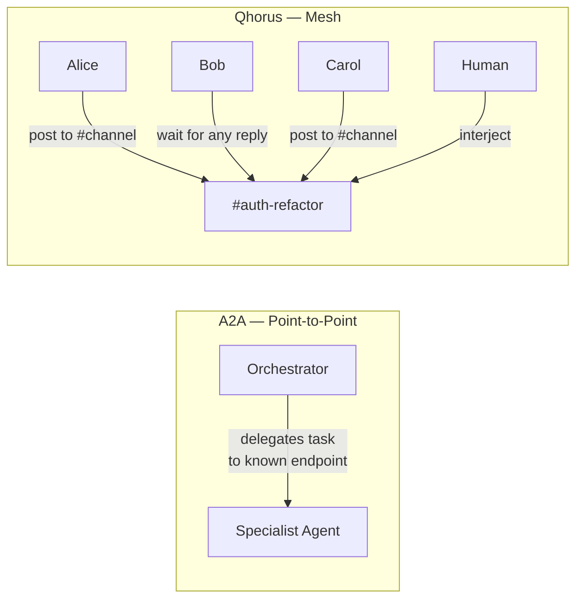
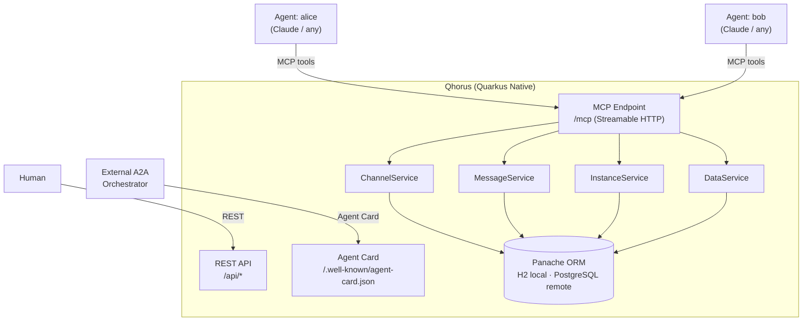
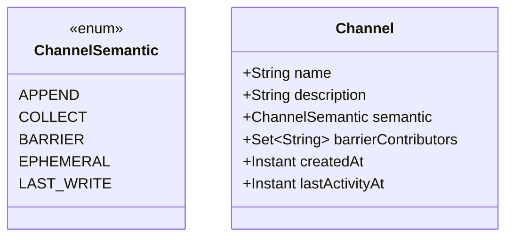
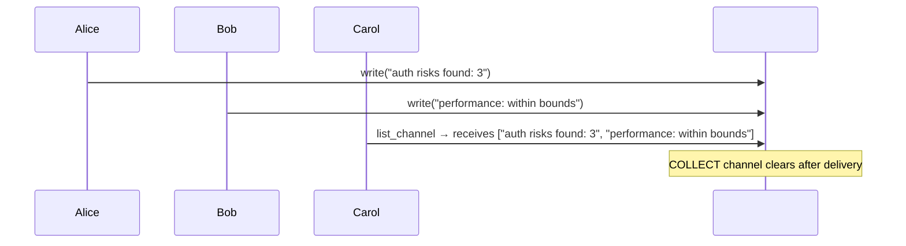
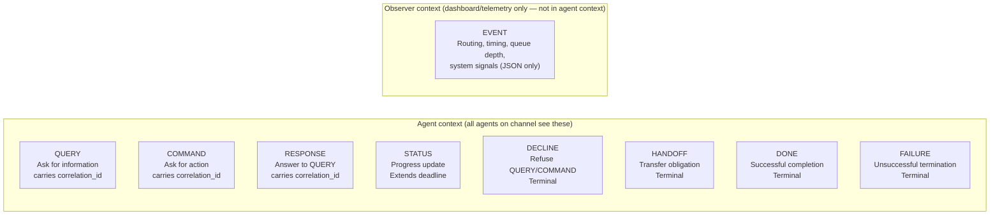
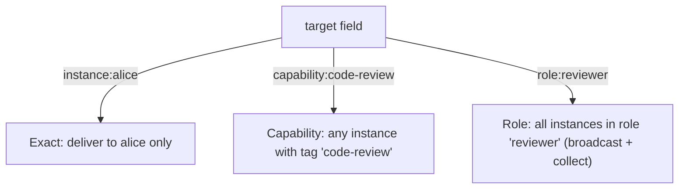
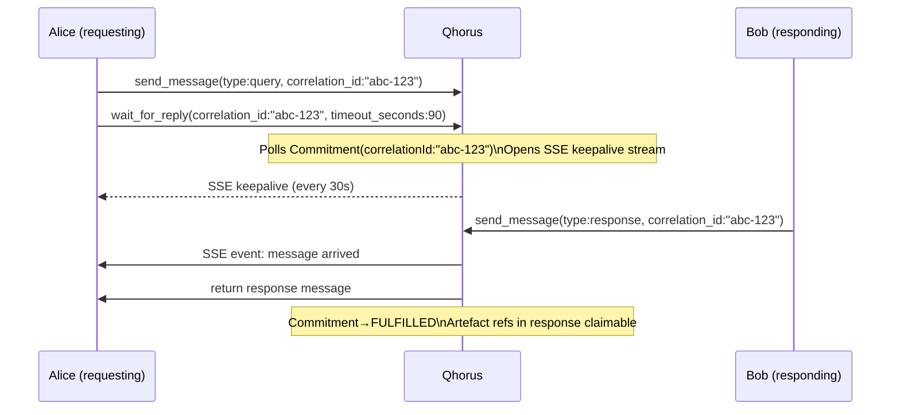
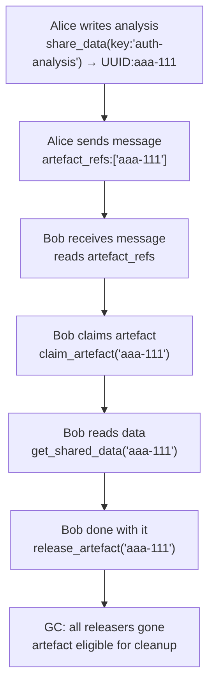
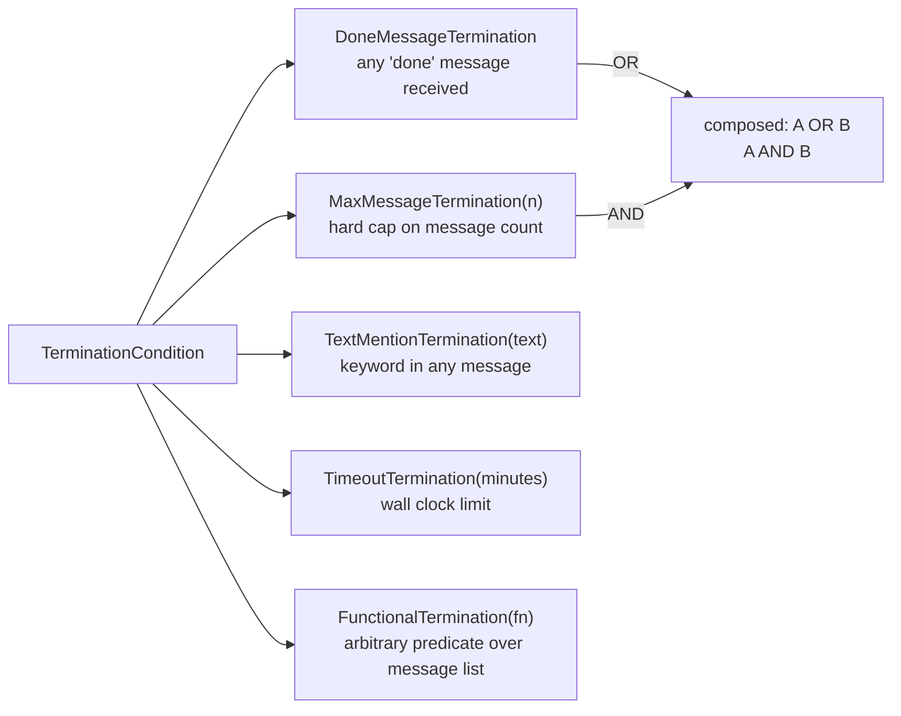
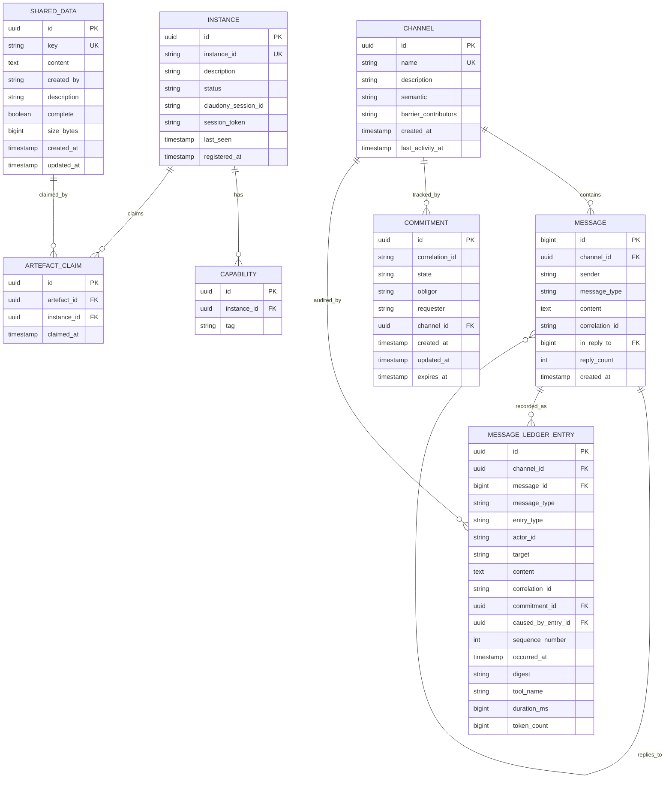

# Qhorus — Agent Communication Mesh
### Design Specification v1.0

> *A Quarkus Native peer-to-peer communication layer for multi-agent AI systems. Any agent. Any framework. Observable by humans.*

---

## What Qhorus Is

Qhorus is the Quarkus Native port of [cross-claude-mcp](https://github.com/rblank9/cross-claude-mcp), redesigned from first principles after research into Google A2A, Microsoft AutoGen, OpenAI Swarm, LangGraph, Letta, and CrewAI.

It solves a specific problem that no other system solves: **N agents collaborating on named channels without knowing each other's addresses, waiting for whoever responds, sharing large artefacts by reference, and being observable by humans in real time.**

More precisely: Qhorus is a **governance methodology** for multi-agent AI, not middleware. It gives every agent interaction the formal status of an accountable act — grounded in thirty years of research in speech act theory, deontic logic, defeasible reasoning, and social commitment semantics — and exposes that methodology as a developer-facing API. The LLM reasons; the infrastructure enforces, records, and derives. For the full methodology framing and business positioning, see `docs/normative-layer.md`.

It is one component of the Quarkus Native AI Agent Ecosystem alongside CaseHub (orchestration) and Claudony (terminal management). The canonical ecosystem design document lives in Claudony at `~/claude/claudony/docs/superpowers/specs/2026-04-13-quarkus-ai-ecosystem-design.md`. Qhorus has no dependency on either other project — it is independently useful and deployable.

---

## Why Not A2A?

Google's [A2A Protocol](https://google.github.io/A2A/) (April 2025, v1.0) is the closest existing standard. The relationship is **complementary, not competing**.



| | A2A | Qhorus |
|---|---|---|
| Topology | Point-to-point (caller → known callee) | Mesh (N:N named channels) |
| Addressing | Explicit endpoint URL | Channel name or capability tag |
| Channels / pub-sub | None | Yes |
| Typed messages | No (content-opaque) | Yes (9 types) |
| Peer presence | Static Agent Cards | Live instance registry |
| Wait-for-any | No | Yes (`wait_for_reply`) |
| Shared data store | No | Yes (artefact refs + lifecycle) |
| MCP integration | No | Yes (is an MCP server) |
| Human interjection | No | Yes (first-class sender) |

**What Qhorus borrows from A2A:**
- Agent Card format at `/.well-known/agent-card.json` — makes Qhorus agents discoverable by A2A orchestrators
- Artefact chunking (`append + last_chunk`) for streaming large outputs
- Optional A2A endpoint mapping `SendMessage` → `send_message` for external orchestrator compatibility

---

## Architecture



**Transport:** Streamable HTTP (MCP spec 2025-06-18). Legacy SSE is deprecated and not the primary transport. The `quarkus-mcp-server-http` extension (v1.11.1) handles all protocol boilerplate — tools are annotated Java methods.

**Persistence:** Panache ORM. H2 file-based for local/dev, PostgreSQL for remote. Same schema, same migrations. No raw SQL — all via Panache entity methods.

---

## Channel Semantics

This is the most significant enhancement over cross-claude-mcp. Channels declare their **update semantics** at creation time, not just their name.



| Semantic | Borrowed From | Behaviour |
|---|---|---|
| `APPEND` | LangGraph `BinaryOperatorAggregate` + `add_messages` | Ordered accumulation; agents can amend prior entries by ID. Default for conversation threads. |
| `COLLECT` | LangGraph `Topic` | N writers contribute; list delivered atomically to subscribers, then cleared. Fan-in primitive. |
| `BARRIER` | LangGraph `NamedBarrierValue` | Named contributors declared at creation; releases only when all have written. Explicit join gate. |
| `EPHEMERAL` | LangGraph `EphemeralValue` | Single-hop: visible to next reader only, then cleared. Routing hints, transient context. |
| `LAST_WRITE` | LangGraph `LastValue` | One authoritative writer; concurrent writes are a protocol error (returns 409). |



---

## Message Type Taxonomy

Nine types in a sealed hierarchy. Type determines routing and observability — not just content.

**Two-part message structure:**
- **Commitment envelope** (infrastructure): `commitmentId`, `deadline`, `acknowledgedAt` — tracks obligation lifecycle
- **LLM payload** (application): `content`, `target`, `artefact_refs[]` — the actual work



| Type | Obligation | Terminal | Requires Content | In Agent Context |
|---|---|---|---|---|
| `QUERY` | Expects RESPONSE or DECLINE | No | No | Yes |
| `COMMAND` | Expects DONE or FAILURE | No | No | Yes |
| `RESPONSE` | Discharges QUERY obligation | No | No | Yes |
| `STATUS` | Extends COMMAND deadline | No | No | Yes |
| `DECLINE` | Refuses QUERY/COMMAND | **Yes** | **Yes** | Yes |
| `HANDOFF` | Transfers obligation to target | **Yes** | No | Yes |
| `DONE` | Signals COMMAND success | **Yes** | No | Yes |
| `FAILURE` | Signals COMMAND failure | **Yes** | **Yes** | Yes |
| `EVENT` | Observer-only telemetry | No | No | **No** |

**Message envelope fields:**
- `commitmentId` (UUID): Links to the originating QUERY or COMMAND obligation. Auto-set by infrastructure.
- `deadline` (Instant): When the obligation must be discharged. Auto-set from channel config default if not provided.
- `acknowledgedAt` (Instant): When the obligation was explicitly accepted. Populated by v2 ACK mechanism (currently null in v1).

**Breaking change:** `REQUEST` type removed. Use `QUERY` (information request) or `COMMAND` (action request) instead.

---

## Normative Audit Ledger

Every message sent on a channel is permanently recorded as a `MessageLedgerEntry` — an
immutable, tamper-evident (SHA-256 hash-chained) record extending the quarkus-ledger
`LedgerEntry` base class via JPA JOINED inheritance.

### Two-Layer Model

| Layer | Component | Purpose |
|---|---|---|
| **Live state** | `CommitmentStore` | Current obligation status — queryable, mutable |
| **Historical record** | Ledger (`MessageLedgerEntry`) | Complete immutable channel history — permanent |

These are complementary. The CommitmentStore answers "what is the current state of
obligation X?"; the ledger answers "what has happened in this channel, in order, permanently?"

### What Gets Recorded

All 9 message types produce a ledger entry when sent via `send_message`:

| Message Type | `entryType` | Causal link set? | Notes |
|---|---|---|---|
| QUERY | COMMAND | No | Information request — declared intent |
| COMMAND | COMMAND | No | Action request — creates obligation |
| RESPONSE | EVENT | No | Answers a QUERY |
| STATUS | EVENT | No | Progress update |
| DECLINE | EVENT | Yes → COMMAND | Obligation refused |
| HANDOFF | COMMAND | Yes → COMMAND | Obligation transferred |
| DONE | EVENT | Yes → COMMAND/HANDOFF | Obligation completed |
| FAILURE | EVENT | Yes → COMMAND/HANDOFF | Obligation failed |
| EVENT | EVENT | No | Tool telemetry — see below |

`entryType` (from quarkus-ledger `LedgerEntryType`) is a coarse classification. All
Qhorus-level filtering uses `messageType` (the full 9-type name).

### Causal Chain

DONE, FAILURE, DECLINE, and HANDOFF entries have `causedByEntryId` set to the most
recent COMMAND or HANDOFF entry sharing the same `correlationId` on the same channel.
This creates a traversable obligation chain inside the ledger itself:

```
seq=1  COMMAND   "Generate compliance report"   causedByEntryId=null
seq=2  STATUS    "Processing…"                  causedByEntryId=null
seq=3  DONE      "Report delivered"             causedByEntryId=<id of seq=1>
```

For delegation:
```
seq=1  COMMAND   "Audit accounts"               causedByEntryId=null
seq=2  HANDOFF   → agent-c                      causedByEntryId=<id of seq=1>
seq=3  DONE      "Audit complete"               causedByEntryId=<id of seq=2>
```

Use `list_ledger_entries` with `type_filter=COMMAND,DONE,FAILURE,DECLINE,HANDOFF` to
retrieve the obligation lifecycle. Use `caused_by_entry_id` in the response to trace
the chain.

### EVENT Telemetry

EVENT entries carry additional fields extracted from the JSON payload:

| Field | Required | Description |
|---|---|---|
| `tool_name` | No | Agent tool that was invoked |
| `duration_ms` | No | Wall-clock duration in milliseconds |
| `token_count` | No | LLM token count |
| `context_refs` | No | JSON array of context references |
| `source_entity` | No | JSON object — source domain entity |

Malformed or partial EVENT payloads still produce a ledger entry — the speech act
happened regardless of telemetry quality. Telemetry fields are null when absent.

### Querying the Ledger

Use `list_ledger_entries`:

```
# Full channel history
list_ledger_entries(channel_name="my-channel")

# Obligation lifecycle only
list_ledger_entries(channel_name="my-channel", type_filter="COMMAND,DONE,FAILURE,DECLINE,HANDOFF")

# Telemetry only
list_ledger_entries(channel_name="my-channel", type_filter="EVENT")

# One agent's actions
list_ledger_entries(channel_name="my-channel", sender="orchestrator")

# Paginate
list_ledger_entries(channel_name="my-channel", after_id=15, limit=20)
```

Response fields: `sequence_number`, `message_type`, `entry_type`, `actor_id`, `target`,
`content`, `correlation_id`, `commitment_id`, `caused_by_entry_id`, `occurred_at`,
`message_id`, plus telemetry fields when present (`tool_name`, `duration_ms`, etc.).

### Trust Layer — Attestations and Derived Trust Scores

The normative ledger is also the substrate for agent trust. quarkus-ledger provides two
complementary trust models, both derived from the immutable ledger record of peer reviews:

**Attestations** (`LedgerAttestation`) are peer review verdicts stamped onto ledger entries.
When an agent reviews another's decision, it records a verdict — `SOUND`, `ENDORSED`,
`FLAGGED`, or `CHALLENGED` — with evidence text and a confidence score. Attestations are
immutable records in the same tamper-evident ledger as obligations.

**Bayesian Beta trust scoring** (`ActorTrustScore`) computes a per-actor trust score from
direct attestation history. Alpha accumulates positive evidence; beta accumulates negative.
The score narrows as more peers attest. It is a property of the ledger record, not of
configuration.

**EigenTrust** (`EigenTrustComputer`) propagates trust transitively via power iteration
(Kamvar et al., 2003). If agent A attests positively to B's decisions, and B attests
positively to C's, A has a derived signal about C. The result is a global trust share for
every actor — a single number in [0.0, 1.0] reflecting standing across the entire observed
peer review network.

**Discovery provenance** extends this to participant registration. CaseHub applies the same
framework to worker registration (casehub-engine ADR-0006): a worker's registration is a
normative act recorded in the ledger via `causedByEntryId`. A worker introduced by a
high-trust provisioner inherits stronger initial deontic standing via EigenTrust propagation.
Trust is a causal chain property, not a label.

For the full trust model treatment, see `docs/normative-layer.md` §"Participant trust and
discovery provenance".

### Design Decision — Complete Audit Trail

Every message type is recorded (not just EVENT) because:

1. **Accountability**: which agent issued which COMMAND, which agent declined, which
   succeeded — must be permanently attributable.
2. **Compliance**: obligation chains (COMMAND → DONE/FAILURE) are the audit evidence
   for automated actions, not just telemetry.
3. **Simplicity**: unconditional recording in the caller (`send_message`) eliminates
   conditional logic and the risk of accidentally omitting a type.
4. **Single entity**: one `MessageLedgerEntry` table with nullable telemetry fields
   avoids UNION queries. `messageType` is the discriminator; telemetry fields are
   clearly EVENT-only.

### Design Decision — Trust derived from behaviour, not configuration

In most agentic systems, trust is hardcoded or assumed. The normative layer provides a third
option: trust computed from the immutable ledger record of what agents have done and how
peers have judged those decisions. Bayesian Beta gives local trust from direct attestation
history. EigenTrust gives global trust propagated transitively through the peer review
network. Neither requires a configuration file. Both update continuously as the system runs.

---

## MCP Tool Surface

All tools exposed via the single `/mcp` Streamable HTTP endpoint.

### Instance Management

| Tool | Description |
|---|---|
| `register` | Register presence with capability tags. Returns active channels and online instances. Optional `claudony_session_id` for Claudony-managed workers. |
| `deregister_instance` | Deregister an instance from the registry. |
| `list_instances` | Live roster with status, capabilities, last-seen. Supports filter by capability tag. |

### Channel Operations

| Tool | Description |
|---|---|
| `create_channel` | Create a named channel with declared semantic (`APPEND` default). |
| `list_channels` | All channels with message count, last activity, active senders. |
| `find_channel` | Keyword search over channel names and descriptions. |
| `get_channel_digest` | Summary digest of a channel — message count, active senders, last activity. |
| `clear_channel` | Remove all messages from a channel. |
| `pause_channel` | Pause a channel — new messages are queued but not delivered. |
| `resume_channel` | Resume a paused channel and flush queued messages. |
| `force_release_channel` | Force-release a BARRIER or COLLECT channel without all contributors. |
| `set_channel_admins` | Declare admin instances for a channel. |
| `set_channel_rate_limits` | Configure per-instance or per-channel rate limits. |
| `set_channel_writers` | Restrict write access to named instances or capability tags. |

### Messaging

| Tool | Description |
|---|---|
| `send_message` | Post to a channel. Type required. `handoff` auto-includes `target` validation. QUERY/COMMAND auto-generate `correlation_id` if not supplied. |
| `check_messages` | Poll for new messages. Excludes EVENT messages (use `read_observer_events` for those). Supports `after_id`, `limit`, sender filter. Returns messages + last ID for subsequent polling. |
| `wait_for_reply` | Persistent long-poll with SSE keepalives. Polls Commitment state by `correlation_id` — wakes when state reaches FULFILLED, DECLINED, FAILED, or EXPIRED. Re-entrant safe: uses UUID not positional matching. Transparently follows HANDOFF delegation chains. |
| `cancel_wait` | Cancel an in-progress `wait_for_reply` for a given correlation ID. |
| `get_replies` | Retrieve replies to a specific message ID. Supports `after_id` and `limit` cursor pagination. |
| `delete_message` | Delete a message by ID. |
| `search_messages` | Full-text search across all channels. |

### Observability

| Tool | Description |
|---|---|
| `register_observer` | Register an observer to receive EVENT messages on a channel. |
| `deregister_observer` | Unregister an observer. |
| `read_observer_events` | Read EVENT messages delivered to a registered observer. |
| `list_ledger_entries` | Query the immutable audit ledger. Supports `type_filter` (e.g. `COMMAND,DONE,FAILURE`), `sender`, `correlation_id`, `sort` (asc/desc), `after_id`, `limit`. Returns `entry_id` (UUID) and causal chain via `caused_by_entry_id`. |
| `get_channel_timeline` | Ordered view of all message types on a channel, including EVENT telemetry. |
| `get_obligation_chain` | Computed enrichment for an obligation (by `correlation_id`): initiator, participants in encounter order, handoff count, elapsed seconds, resolution type, and live CommitmentStore state. Returns null fields (not an error) for unknown correlation IDs. |
| `get_causal_chain` | Compliance audit tool. Given a `ledger_entry_id` (UUID from `list_ledger_entries`), walks `caused_by_entry_id` links upward to the root. Returns chain ordered oldest-first. Returns empty list for unknown entry IDs. |
| `list_stalled_obligations` | COMMAND entries with no terminal sibling (DONE / FAILURE / DECLINE / HANDOFF) sharing the same `correlation_id`, older than `older_than_seconds` (default 30). Returns `stalled_for_seconds` per entry. |
| `get_obligation_stats` | Obligation outcome statistics for a channel: `total_commands`, `fulfilled`, `failed`, `declined`, `delegated`, `still_open`, `stalled`, `fulfillment_rate`. |
| `get_telemetry_summary` | EVENT telemetry aggregated by tool name: per-tool `count`, `avg_duration_ms`, `total_tokens`; channel-wide `total_events`, `total_tokens`, `total_duration_ms`. Optional `since` (ISO-8601) filter. |

### Commitments

| Tool | Description |
|---|---|
| `get_commitment` | Retrieve the current state of a commitment by correlation ID. |
| `list_my_commitments` | List all active commitments for the calling instance. |
| `list_pending_waits` | List all in-progress `wait_for_reply` sessions. |

### Approval Gates

| Tool | Description |
|---|---|
| `request_approval` | Submit an action for human or agent approval. Blocks until approved, declined, or timed out. |
| `respond_to_approval` | Respond to a pending approval request (approve or decline). |
| `list_pending_approvals` | List all approval requests awaiting response. |

### Watchdogs

| Tool | Description |
|---|---|
| `register_watchdog` | Register a condition-based alert on a channel (e.g. inactivity timeout, message threshold). |
| `delete_watchdog` | Remove a registered watchdog. |
| `list_watchdogs` | List all registered watchdogs with their conditions. |

### Shared Data / Artefacts

| Tool | Description |
|---|---|
| `share_data` | Store a large artefact by key. Returns UUID artefact ref. Supports chunked upload (`append: true`, `last_chunk: true`). |
| `get_shared_data` | Retrieve by key or UUID. |
| `list_shared_data` | All artefacts with size, owner, description. |
| `claim_artefact` | Declare this instance holds a reference. Prevents GC. |
| `release_artefact` | Release the reference. GC-eligible when all claiming instances release. |
| `revoke_artefact` | Forcibly revoke an artefact — marks it unavailable regardless of active claims. |

### Addressing Modes

`send_message` and `wait_for_reply` support three addressing modes for the `target` field:



Borrowed from Letta's tag-based broadcast model.

---

## wait_for_reply — Design Detail

This is the most critical tool and the one no other framework gets right.



**Key design rules (from LangGraph interrupt model):**
1. `correlation_id` is a UUID — not positional. Multiple concurrent waits are safe.
2. The `thread_key` (`instance_id + channel`) is the persistence cursor — same key resumes, new key starts fresh.
3. Any work done before calling `wait_for_reply` must be committed to state (message sent, artefacts stored) — `wait_for_reply` is a potential restart boundary.
4. On timeout, returns a `status` message so the agent can decide: retry, escalate, or disconnect.
5. `persistent: true` (default) keeps listening across cycles up to `max_wait_minutes`. `persistent: false` for one-shot polling.

---

## Artefact Lifecycle

Messages carry `artefact_refs: List<UUID>` — not inline payloads. The shared store is the only way to exchange data over ~500 chars.



Chunked streaming (for large or streaming outputs):
```
share_data(key:'report', content:'chunk1...', append:false)
share_data(key:'report', content:'chunk2...', append:true)
share_data(key:'report', content:'final...', append:true, last_chunk:true)
```
Borrowed from A2A's `TaskArtifactUpdateEvent.append + last_chunk` pattern.

---

## Agent Card

Every Qhorus deployment serves an Agent Card at `/.well-known/agent-card.json`. This makes it discoverable by A2A orchestrators and self-describing to any client.

```json
{
  "name": "Qhorus Agent Mesh",
  "description": "Peer-to-peer agent communication mesh — channels, messages, shared data, presence",
  "url": "https://your-qhorus-instance.example.com",
  "version": "1.0.0",
  "skills": [
    {
      "id": "channel-messaging",
      "name": "Channel Messaging",
      "description": "Send and receive typed messages on named channels"
    },
    {
      "id": "shared-data",
      "name": "Shared Data Store",
      "description": "Store and retrieve large artefacts by key with lifecycle management"
    },
    {
      "id": "presence",
      "name": "Agent Presence",
      "description": "Register agents with capability tags and discover online peers"
    }
  ],
  "capabilities": {
    "streaming": true,
    "mcp": true
  }
}
```

---

## Termination Conditions

Borrowed from AutoGen's composable termination model. Conversations/channels can declare completion conditions:



Used by the dashboard and by CaseHub (when embedded in Claudony) to know when a channel conversation is complete without polling.

---

## Deployment

### Standalone (local or remote)

```bash
# Local — H2 file DB, single process
./qhorus-runner

# Remote — PostgreSQL, Railway/Fly.io
DATABASE_URL=postgres://... PORT=7779 ./qhorus-runner
```

### Embedded in Claudony

Qhorus is designed as an embeddable dependency. Claudony adds `qhorus` as a Maven dependency. The Qhorus MCP tools are registered on Claudony's Agent MCP endpoint alongside Claudony's session tools and CaseHub worker tools.

**Protocol discipline (Phase C):** All Qhorus tools work identically whether standalone or embedded. No Claudony-specific fields are required — `claudony_session_id` is always optional context. This ensures standalone Qhorus works for non-Claudony agents.

### A2A Compatibility (optional, Phase A)

When `qhorus.a2a.enabled=true`, Qhorus exposes an additional A2A-compatible endpoint:
- `POST /a2a/message:send` → maps to `send_message` on the specified channel
- `GET /a2a/tasks/{id}` → maps to `check_messages` with the task ID as correlation_id

External A2A orchestrators can delegate to Qhorus without knowing it's an MCP server.

---

## Data Model



---

## Differences From cross-claude-mcp

| Feature | cross-claude-mcp (Node.js) | Qhorus (Quarkus Native) |
|---|---|---|
| Channel semantics | Single type (append only) | 5 semantics: APPEND, COLLECT, BARRIER, EPHEMERAL, LAST_WRITE |
| Message types | 6 (request, response, status, handoff, done, event) | 9: QUERY, COMMAND, RESPONSE, STATUS, DECLINE, HANDOFF, DONE, FAILURE, EVENT (obligation-based) |
| Message envelope | None | Commitment tracking: commitmentId, deadline, acknowledgedAt |
| `wait_for_reply` | Polls any message on channel | Correlation ID, UUID-keyed, persistent-by-default |
| Shared data | Blob by key | UUID artefact refs + claim/release lifecycle + chunked streaming |
| Instance addressing | By `instance_id` only | By id · by capability · by role (tag-based) |
| HandoffMessage safety | No enforcement | Terminal for turn; in-flight results discarded |
| Termination conditions | `done` message only | Composable (done · max · keyword · timeout · functional) |
| Agent Card | None | `/.well-known/agent-card.json` (A2A compatible) |
| Transport | stdio + legacy SSE + Streamable HTTP | Streamable HTTP (spec 2025-06-18) |
| Runtime | Node.js ~80MB | GraalVM Native ~30MB |
| Database | SQLite / PostgreSQL (raw SQL) | Panache ORM, H2 / PostgreSQL |

---

## Design Decisions

Why each significant departure from cross-claude-mcp was made.

### Channel semantics (5 types instead of append-only)

The original has one implicit semantic: ordered append. This works for simple conversation threads but breaks for three common multi-agent patterns:

- **Fan-in** (multiple agents contribute, one reads the aggregate) — needs COLLECT
- **Join gates** (proceed only when all named contributors have written) — needs BARRIER
- **Authoritative state** (one writer, any concurrent write is a bug) — needs LAST_WRITE

Without declared semantics, agents must implement these patterns themselves — in their prompts, with no enforcement. The result is race conditions that are invisible until they cause wrong output. Declaring semantics at channel creation time makes the contract explicit and enforceable server-side.

Each semantic maps to a named primitive from LangGraph's Pregel model, where the same insight was applied to graph state reducers.

### QUERY/COMMAND obligation model (replacing generic REQUEST)

The original's `request` type is ambiguous — does the receiver answer a question or execute an action? The distinction changes expected response format, timeout semantics, and retry logic.

- `QUERY`: Information request. Expects `RESPONSE` or `DECLINE`. No obligation tracking required.
- `COMMAND`: Action request. Expects `DONE` (success) or `FAILURE` (error with reason). Obligation tracked via `commitmentId`, with optional deadline and acknowledgment.

This separation makes protocols explicit and enables deadline enforcement at the infrastructure level rather than in application code.

### Message envelope (commitment tracking)

Messages carry three infrastructure fields for obligation lifecycle:
- `commitmentId`: Links a RESPONSE, DECLINE, DONE, or FAILURE back to the originating QUERY or COMMAND. Auto-set by the system.
- `deadline`: When the obligation must be discharged (e.g., 90 seconds from now). Null for non-obligating messages (STATUS, RESPONSE, EVENT). Auto-set from channel config if not provided by sender.
- `acknowledgedAt`: When the receiver accepted the obligation. Populated by v2 ACK mechanism (currently null in v1).

This enables watchdog timers, SLA metrics, and deadline-driven escalation without coupling them to message content.

### `event` message type (observer-only)

The original's types all appear in agent context — agents receive routing decisions, queue depths, and system signals mixed in with work messages. This forces agents to filter noise and risks prompt pollution.

`event` is excluded from agent context entirely. It exists for the dashboard, telemetry pipeline, and CaseHub's orchestration layer — not for agent consumption. Separation keeps agent prompts clean and makes system observability a first-class concern without coupling it to agent behaviour.

### `wait_for_reply` with UUID correlation IDs

The original `wait_for_reply` polls for any message newer than `after_id` from any sender that isn't the caller. This works for single-threaded request/response but breaks when an agent has multiple concurrent requests in flight — message N+1 may be a reply to request B, not request A.

UUID correlation IDs decouple reply matching from message ordering. Each QUERY or COMMAND carries a `correlation_id`; `wait_for_reply` polls the `Commitment` keyed to that UUID and wakes when the state reaches FULFILLED, DECLINED, FAILED, or EXPIRED. Multiple concurrent waits are safe. The approach follows LangGraph's interrupt model, where the resume cursor is a stable key, not a positional offset.

### Artefact refs instead of inline payloads

The original puts data inline in message `content`. This has two failure modes:

1. Large content (analysis, plans, code) bloats the message table and hits MCP message size limits
2. If multiple agents receive the same large payload, it is duplicated in memory for each

Artefact refs (`List<UUID>` on messages) separate the transport from the storage. The shared data store holds one copy; messages carry only the reference. Agents call `claim_artefact` to prevent GC while they are consuming it and `release_artefact` when done. This enables proper lifecycle management — artefacts are cleaned up when no active consumer holds a claim, not on an arbitrary timer.

### Claim/release lifecycle

The original `shared_data` has no lifecycle — data is either present or deleted by key. There is no way to know whether an artefact is still being consumed before cleaning it up.

The claim/release model is borrowed from reference counting. An artefact is GC-eligible when its claim count reaches zero. This is safe for GC even when multiple agents are consuming the same artefact concurrently, and it gives the cleanup job a precise signal rather than a TTL guess.

### Chunked streaming for artefacts

Large model outputs (long reports, full codebases) cannot be written atomically in a single tool call without hitting timeouts or context limits. Chunked upload (`append: true`, `last_chunk: true`) allows an agent to stream output incrementally while consumers wait for `complete: true` before reading.

The pattern is directly borrowed from A2A's `TaskArtifactUpdateEvent.append + last_chunk` — the same problem exists in the A2A protocol and they solved it the same way.

### Capability and role addressing

The original routes to agents by `instance_id` only — the sender must know the exact ID of the recipient. This breaks for dynamic agent pools where the set of available agents changes, and for broadcast patterns where all agents with a given skill should respond.

Three addressing modes follow Letta's tag-based dispatch:
- `instance:alice` — exact, same as original
- `capability:code-review` — any available instance with that tag (load-balance or first-responder)
- `role:reviewer` — all instances in that role (broadcast + collect)

This decouples agent identity from agent capability and enables dynamic pool management without re-wiring sender logic.

### HandoffMessage terminates the turn

The original has no enforcement of handoff semantics. An agent can produce a `handoff` and then continue producing tool results in the same turn. If those results arrive after the handoff recipient has started work, the last writer wins silently — the same race condition that causes subtle bugs in AutoGen and Swarm pipelines.

Qhorus enforces that `handoff` is terminal: any in-flight results for that turn are logged and discarded once a `handoff` is produced. This is an explicit choice — correctness over permissiveness. If the caller sends more messages after a `handoff`, they receive an error, not silent acceptance.

### UUID primary keys throughout

The original uses text primary keys (channel name, instance_id, data key) and integer serials for messages. Text PKs couple the identity of a record to its human-readable name — renaming a channel would require cascading updates across foreign keys.

Qhorus uses UUIDs as stable internal PKs and moves human-readable names to unique-constrained columns. Names can be changed without touching FK relationships. This also prepares for multi-region replication where integer serials would collide.

### `reply_count` as a stored column

The original computes `reply_count` via a subquery on every message read (`SELECT COUNT(*) FROM messages WHERE in_reply_to = m.id`). At low message volumes this is fine; at scale, listing a channel with 10,000 messages fires 10,000 correlated subqueries.

Storing `reply_count` as a denormalized column trades a small write overhead (increment on each reply) for a constant-time read. Panache's `@PreUpdate` / explicit increment in `MessageService` keeps it consistent.

---

## Build Roadmap

| Phase | What |
|---|---|
| **1 — Core** | Data model, ChannelService, MessageService, InstanceService, DataService |
| **2 — MCP tools** | All tools via `@Tool` annotations on `QhorusMcpTools`, basic APPEND channels only |
| **3 — Channel semantics** | COLLECT, BARRIER, EPHEMERAL, LAST_WRITE semantics |
| **4 — Correlation** | `wait_for_reply` with correlation IDs, CommitmentStore lifecycle tracking, SSE keepalives |
| **5 — Artefacts** | Claim/release lifecycle, chunked streaming, artefact_refs on messages |
| **6 — Addressing** | Capability tags, tag-based dispatch, role broadcast |
| **7 — Agent Card** | `/.well-known/agent-card.json`, self-describing skills |
| **8 — Embed in Claudony** | Claudony adds Qhorus as dependency, unified MCP endpoint |
| **9 — A2A compat** | Optional A2A endpoint for external orchestrator interop |
| **10 — Human-in-the-loop controls** | `pause_channel` / `resume_channel`; `request_approval` (agent-callable, blocks until human responds); external cancellation of pending `wait_for_reply`; force-close BARRIER/COLLECT channels; artefact revocation |
| **11 — Access control and governance** | Per-channel write permissions (declare allowed `instance_id`s or `capability:tag`s); admin role (a designated instance can pause/resume/close channels on behalf of others); rate limiting per channel or per instance; read-only observer mode (subscribe to events without appearing in the instance registry) |
| **12 — Normative audit ledger** ✓ | All 9 message types recorded as immutable `MessageLedgerEntry` (SHA-256 hash-chained, JPA JOINED inheritance on quarkus-ledger `LedgerEntry`). Ledger query tools: `list_ledger_entries` (type_filter, sender, correlation_id, sort, after_id, limit, entry_id in output), `get_channel_timeline`, `get_obligation_chain` (participants, handoff count, elapsed, resolution), `get_causal_chain` (walk causedByEntryId to root), `list_stalled_obligations`, `get_obligation_stats` (fulfillment rate per channel), `get_telemetry_summary` (per-tool EVENT aggregation). Causal chain via `caused_by_entry_id`. EVENT entries carry telemetry fields. |

---

*This specification incorporates research from: Google A2A v1.0, Microsoft AutoGen, OpenAI Swarm, LangGraph (Pregel model), Letta (MemGPT), CrewAI, MCP spec 2025-06-18, and quarkus-mcp-server 1.11.1.*
